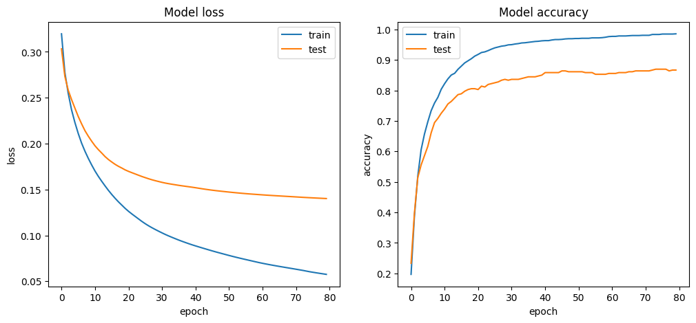

# Multilayer Perceptron (MLP) 

### This project recognizes handwritten numbers from 0 to 9 using Multilayer Perceptron.


## How to Install
Run following command:
```
pip install -r requirements.txt
```

### Evaluation results:



|   |  train data  | test data |
| --------------- | --------------- | --------------- |
| Loss | 5 % | 12 % |
| Accuracy | 99 % | 91 % |


## How to Run
Execute this command in terminal:
```
jupyter nbconvert --to script multilayer_perceptron_classification.ipynb
```

## Python
The programs are written using [Python](https://www.python.org/) language and the following tools:


