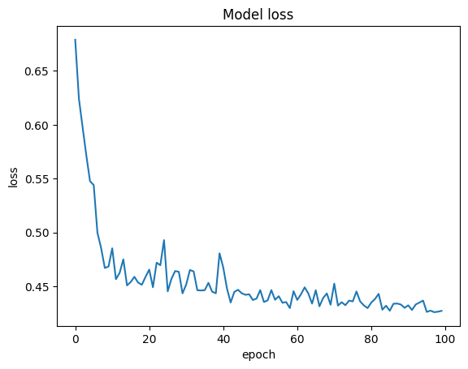
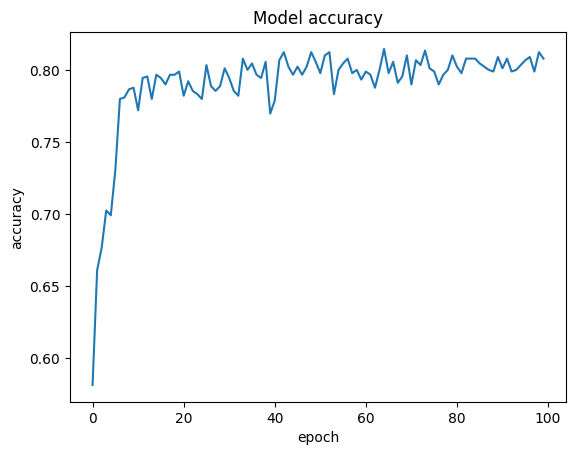

# MLP using TensorFlow

## Titanic 🚢

In this challenge, predictive model is built that answers the question: what kind of people were more likely to survive?

## How to Install
Run following command:
```
pip install -r requirements.txt
```

### Evaluation results:





|   |  train data  | test data |
| --------------- | --------------- | --------------- |
| Accuracy | 81 % | 94 % |

According to model prediction on Jack and Rose data, Jack won't survive but Rose will.

### Comparison of algorithms:

| Algorithm | Accuracy |
| --------------- | --------------- |
| Perceptron | 95 % |
| MLP (Multi Layer Perceptron) | 94 % |

## How to Run
Execute this command in terminal:
```
jupyter nbconvert --to script Titanic_MLP.ipynb
```

## Python
The programs are written using [Python](https://www.python.org/) language and the following tools:


